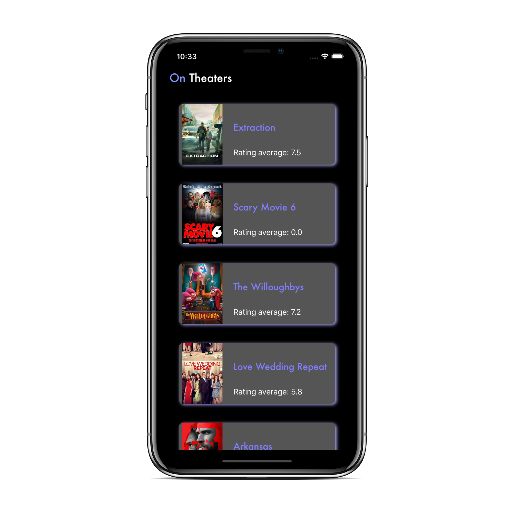

# Code Challenge iOS (Movie Time)

Aplicação iOS de catálogo de filmes com uso da TheMovieDB API

## Screenshots

### Lista de filmes (tela principal)

 

### Detalhes do filme

 

## Implementação

- Swift 5/XCode 11
- CocoaPods para gerenciamento de dependências
- Alamofire (requisições REST)
- Kingfisher (Download de imagens)
- ObjectMapper (mapeamento de JSON para objetos Swift)

## Design Patterns
- Coordinator